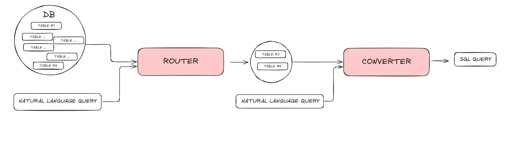
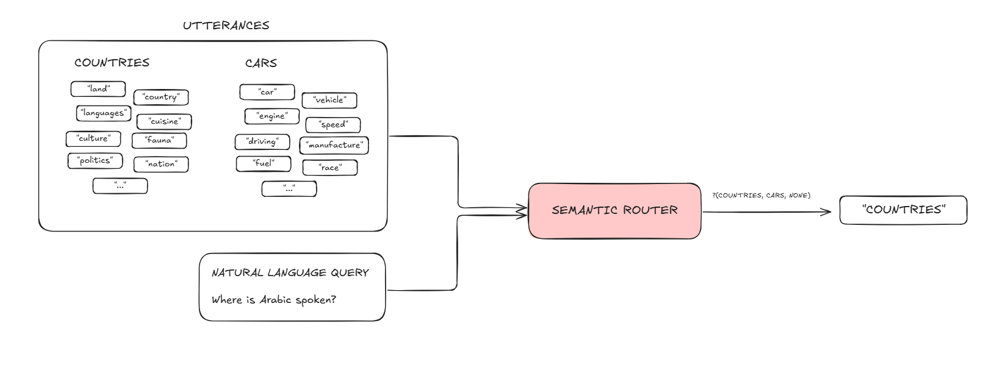

# Fast Db Searcher

## Overview

This project, detailed in `main.ipynb`, implements a system to convert natural language queries into SQL statements. It leverages a Large Language Model (LLM) – specifically Meta Llama 3.3 8B accessed via OpenRouter – and aims to minimize LLM calls to reduce latency. The core logic involves a two-stage process: a **Router** to identify the relevant database table(s) and a **Converter** to perform the natural language to SQL translation.



## How it Works

The system is divided into two main components:

### 1. Router

The Router's primary function is to determine which database table(s) are relevant to the user's natural language query.
- It employs the `semantic-router` library.
- This library assesses the semantic similarity between the input query and predefined "utterances" (collections of keywords and phrases) associated with different data topics (e.g., "cars," "countries").
- Based on these similarity scores, the router categorizes the query, deciding if it pertains to a specific topic or is unrelated.
- Crucially, this routing stage **does not use an LLM**, relying instead on efficient vector similarity comparisons provided by an encoder (e.g., `OpenAIEncoder`).



The notebook demonstrates an iterative improvement in router accuracy by refining utterances from single keywords to more descriptive multi-word phrases, enhancing its ability to distinguish between topics.

### 2. Converter

Once the Router has identified the appropriate table(s), the Converter translates the natural language query into an SQL statement.
- This stage utilizes the **Meta Llama 3.3 8B Instruct model**, accessed through the OpenRouter API.
- A detailed prompt is constructed and sent to the LLM, containing:
    - The original natural language query.
    - The schema (column names, types, descriptions) of the target table(s).
    - Sample data (e.g., the first few rows) from the target table(s).
- The LLM processes this information and returns the corresponding SQL query, formatted as a JSON object (e.g., `{"sql_query": "SELECT ..."}`).

## Database

The project uses a simple SQLite database named `data.db` located in the `data/` directory for demonstration. This database contains two tables:
- `cars_data`: Contains information related to cars.
- `countries_data`: Contains information related to countries.

Helper functions in `utils/helper.py` are used to extract schema information and sample data from this database.

## Key Features

- **Two-Stage Processing**: Efficiently routes queries using semantic similarity before invoking the more resource-intensive LLM.
- **Minimized LLM Calls**: The router stage operates without LLM intervention, significantly reducing latency and potential costs.
- **Semantic Routing**: Leverages the `semantic-router` library for intelligent and context-aware table selection.
- **Contextual SQL Generation**: Provides the LLM with table schema and sample data, enabling more accurate and relevant SQL query generation.
- **Scalable Prompting**: The prompt template used for the LLM is designed to be adaptable if multiple tables need to be queried simultaneously.
- **Performance Evaluation**: The notebook includes a process for testing the router's accuracy using a set of sample queries and generating a `report.json`.

## Setup and Installation

1.  **Clone the repository:**
    ```bash
    git clone <your-repository-url>
    cd fast_db_searcher
    ```

2.  **Create and activate a Python virtual environment (recommended):**
    ```bash
    python -m venv venv
    # On macOS/Linux:
    source venv/bin/activate
    # On Windows:
    # venv\Scripts\activate
    ```

3.  **Install dependencies:**
    The notebook installs packages directly. For a more structured setup, create a `requirements.txt` file. The primary dependencies mentioned or used are `semantic-router`, `openai`, and `tqdm`.
    You can create `requirements.txt` by running the following in your activated virtual environment after installing the packages:
    ```bash
    pip install semantic-router openai tqdm "openai>=1.0.0" # Ensure openai version compatibility if needed
    pip freeze > requirements.txt
    ```
    Then, install dependencies using:
    ```bash
    pip install -r requirements.txt
    ```

4.  **Set up Environment Variables:**
    The project requires API keys for the `semantic-router`'s encoder (if using `OpenAIEncoder`) and for the OpenRouter API (to access the Llama model). Set these as environment variables:

    ```bash
    export OPENAI_API_KEY="your_actual_openai_api_key" # Used by semantic_router.encoders.OpenAIEncoder
    export OPENROUTER_API_KEY="your_actual_openrouter_api_key" # Used for LLM via OpenRouter
    ```
    On Windows, use `set` instead of `export`:
    ```bash
    set OPENAI_API_KEY="your_actual_openai_api_key"
    set OPENROUTER_API_KEY="your_actual_openrouter_api_key"
    ```
    *Note: If you configure `semantic-router` to use a different encoder (e.g., a local one), the `OPENAI_API_KEY` might not be necessary.*

## Usage

1.  Ensure all dependencies are installed and environment variables are correctly set.
2.  The file `queries.json` (containing sample queries for router testing) is loaded by the notebook. Ensure this file exists in the root directory with the expected format.
3.  Open and run the `main.ipynb` Jupyter Notebook using Jupyter Lab or Jupyter Notebook.
    ```bash
    jupyter lab main.ipynb
    # or
    # jupyter notebook main.ipynb
    ```
4.  The notebook will guide you through:
    - Defining utterances and routes for the `SemanticRouter`.
    - Testing the router with queries from `queries.json` and saving the results to `report.json`.
    - Demonstrating the end-to-end process: taking a sample natural language query, routing it to the correct table, generating an SQL query using the LLM, and executing it against the `data/data.db` database.
    - The results of the SQL query execution will be printed in the notebook.

## Project Structure

```
.
├── main.ipynb            # The main Jupyter Notebook containing the core logic and demonstrations.
├── README.md             # This README file.
├── data/
│   ├── data.db           # SQLite database file.
│   └── json/
│       └── cars_data.json # Potentially a source file for car data (not directly used by DB in notebook).
├── images/
│   ├── general_schema.PNG # Diagram: Overall system architecture.
│   └── semantic_router_schema.png # Diagram: Semantic router workflow.
├── utils/
│   ├── helper.py         # Python module with helper functions (e.g., get_column_info, get_table_sample).
│   ├── prompt.py         # (Present in file structure, not directly used in main.ipynb)
│   └── utterances.py     # (Present in file structure, not directly used in main.ipynb)
├── nl2sql_converter.py   # (Present in file structure, not directly used in main.ipynb)
├── router.py             # (Present in file structure, not directly used in main.ipynb)
├── queries.json          # (Required by notebook for router testing, ensure it exists)
├── report.json           # (Generated by the notebook after router testing)
└── requirements.txt      # (Recommended: list of Python dependencies)
```

## Contributing

Contributions are welcome! For significant changes, please open an issue first to discuss your proposed alterations. Feel free to submit pull requests for bug fixes or enhancements.

## License

This project is licensed under the MIT License. See the [LICENSE](LICENSE) file for details.
